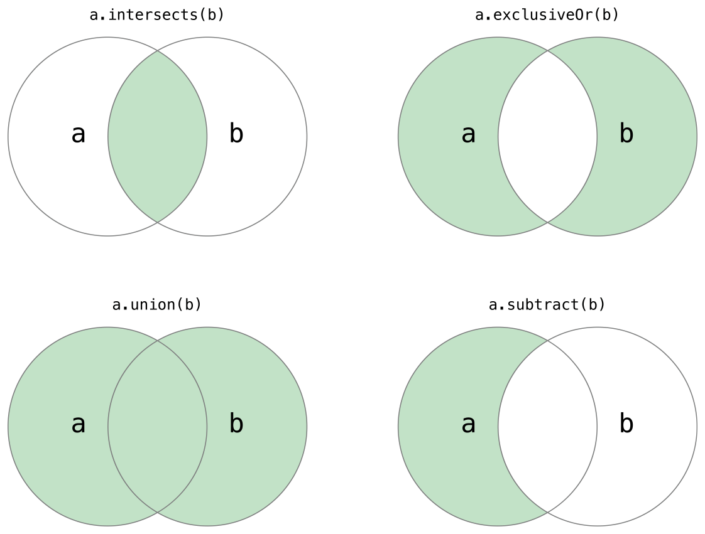

#集合类型

##数组

###数组构造
```swift
// shoppingList 已经被构造并且拥有两个初始项。
var shoppingList: [String] = ["Eggs", "Milk"]

// 或
var shoppingList = ["Eggs", "Milk"]

```

###访问和修改数组
```swift
// 输出"The shopping list contains 2 items."（这个数组有2个项）
println("The shopping list contains \(shoppingList.count) items.")

// 打印 "The shopping list is not empty."（shoppinglist不是空的）
if shoppingList.isEmpty {
    println("The shopping list is empty.")
} else {
    println("The shopping list is not empty.")
}

// shoppingList 现在有3个数据项，有人在摊煎饼
shoppingList.append("Flour")

shoppingList += ["Baking Powder"]
// shoppingList 现在有四项了
shoppingList += ["Chocolate Spread","Cheese","Butter"]
// shoppingList 现在有七项了

// 第一项是 "Eggs"
var firstItem = shoppingList[0]

// 其中的第一项现在是 "Six eggs" 而不是 "Eggs"
shoppingList[0] = "Six eggs"

// shoppingList 现在有六项
shoppingList[4...6] = ["Bananas", "Apples"]

shoppingList.insert("Maple Syrup", atIndex: 0)
// shoppingList 现在有7项
// "Maple Syrup" 现在是这个列表中的第一项

let mapleSyrup = shoppingList.removeAtIndex(0)
// 索引值为0的数据项被移除
// shoppingList 现在只有6项，而且不包括Maple Syrup
// mapleSyrup常量的值等于被移除数据项的值 "Maple Syrup"

// firstItem 现在等于 "Six eggs"
firstItem = shoppingList[0]

let apples = shoppingList.removeLast()
// 数组的最后一项被移除了
// shoppingList现在只有5项，不包括cheese
// apples 常量的值现在等于"Apples" 字符串
```

###数组的遍历
```swift
for item in shoppingList {
    println(item)
}
// Six eggs
// Milk
// Flour
// Baking Powder
// Bananas
```

###特定类型构造
```swift
var someInts = [Int]()
println("someInts is of type [Int] with \(someInts.count) items。")
// 打印 "someInts is of type [Int] with 0 items。"（someInts是0数据项的Int[]数组）

omeInts.append(3)
// someInts 现在包含一个INT值
someInts = []
// someInts 现在是空数组，但是仍然是[Int]类型的。

var threeDoubles = [Double](count: 3, repeatedValue:0.0)
// threeDoubles 是一种 [Double]数组, 等于 [0.0, 0.0, 0.0]

var anotherThreeDoubles = Array(count: 3, repeatedValue: 2.5)
// anotherThreeDoubles is inferred as [Double], and equals [2.5, 2.5, 2.5]

var sixDoubles = threeDoubles + anotherThreeDoubles
// sixDoubles 被推断为 [Double], 等于 [0.0, 0.0, 0.0, 2.5, 2.5, 2.5]
```

##集合
###构造Set
```swift
var letters = Set<Character>()
println("letters is of type Set<Character> with \(letters.count) items.")
// 打印 "letters is of type Set<Character> with 0 items."

// letters现在含有1个Character类型的值
letters.insert("a")

// letters现在是一个空的Set, 但是它依然是Set<Character>类型
letters = []

// favoriteGenres被构造成含有三个初始值的集合
var favoriteGenres: Set<String> = ["Rock", "Classical", "Hip hop"]

//可推断类型为 Set<String>
var favoriteGenres: Set = ["Rock", "Classical", "Hip hop"]
```

###访问和修改Set
```swift
// 打印 ""I have 3 favorite music genres.""
println("I have \(favoriteGenres.count) favorite music genres.")

if favoriteGenres.isEmpty {
    println("As far as music goes, I'm not picky.")
} else {
    println("I have particular music preferences.")
}
// 打印 "I have particular music preferences."

// 添加，favoriteGenres 现在包含4个元素
favoriteGenres.insert("Jazz")

// 删除， 如果该值是该Set的一个元素则删除该元素并且返回被删除的元素值，否认如果该Set不包含该值，则返回nil
if let removedGenre = favoriteGenres.remove("Rock") {
    println("\(removedValue)? I'm over it.")
} else {
    println("I never much cared for that.")
}
// 打印 "Rock? I'm over it."

//removeAll 删除所有

//contains
if favoriteGenres.contains("Funk") {
    println("I get up on the good foot.")
} else {
    println("It's too funky in here.")
}
// 打印 "It's too funky in here.

```

###遍历Set
```swift
for genre in favoriteGenres {
    println("\(value)")
}
// Classical
// Jazz
// Hip hop

// sorted
for genre in sorted(favoriteGenres) {
    println("\(genre)")
}
// prints "Classical"
// prints "Hip hop"
// prints "Jazz

```

###集合操作

```swift

/*
使用union(_:)方法根据两个集合的值创建一个新的集合。
使用subtract(_:)方法根据不在该集合中的值创建一个新的集合。
使用intersect(_:)方法根据两个集合中都包含的值创建的一个新的集合。
使用exclusiveOr(_:)方法根据值在一个集合中但不在两个集合中的值创建一个新的集合。
*/

let oddDigits: Set = [1, 3, 5, 7, 9]
let evenDigits: Set = [0, 2, 4, 6, 8]
let singleDigitPrimeNumbers: Set = [2, 3, 5, 7]
sorted(oddDigits.union(evenDigits))
// [0, 1, 2, 3, 4, 5, 6, 7, 8, 9]
sorted(oddDigits.intersect(evenDigits))
// []
sorted(oddDigits.subtract(singleDigitPrimeNumbers))
// [1, 9]
sorted(oddDigits.exclusiveOr(singleDigitPrimeNumbers))
// [1, 2, 9]

```

###集合比较

```swift
/*
使用“是否等”运算符(=)来判断两个集合是否包含相同的值。
使用isSubsetOf(_:)方法来判断一个集合中的值是否也被包含在另外一个集合中。
使用isSupersetOf(_:)方法来判断一个集合中包含的值是另一个集合中所有的值。
使用isStrictSubsetOf(_:)或者isStrictSupersetOf(_:)方法来判断一个集合是否是另外一个集合的子集合或者父集合并且和特定集合不相等。
使用isDisjointWith(_:)方法来判断两个结合是否不含有相同的值。
*/

let houseAnimals: Set = ["🐶", "🐱"]
let farmAnimals: Set = ["🐮", "🐔", "🐑", "🐶", "🐱"]
let cityAnimals: Set = ["🐦", "🐭"]
houseAnimals.isSubsetOf(farmAnimals)
// true
farmAnimals.isSuperSetOf(houseAnimals)
// true
farmAnimals.isDisjointWith(cityAnimals)
// true
```

###Set类型的哈希值
```swift
/*
为了存储在集合中，该类型必须是可哈希化的-也就是说，该类型必须提供一个方法来计算它的哈希值。
一个哈希值是Int类型的，它和其他的对象相同，其被用来比较相等与否，比如a==b,它遵循的是a.hashValue == b.hashValue。

a==a(自反性)
a==b意味着b==a(对称性)
a==b&&b==c意味着a==c(传递性)

*/
```

##字典

###字典字面量
```swift
var airports: [String:String] = ["TYO": "Tokyo", "DUB": "Dublin"]
//或
var airports = ["TYO": "Tokyo", "DUB": "Dublin"]
```
###读取和修改字典
```swift
println("The dictionary of airports contains \(airports.count) items.")
// 打印 "The dictionary of airports contains 2 items."（这个字典有两个数据项）

if airports.isEmpty {
    println("The airports dictionary is empty.")
} else {
    println("The airports dictionary is not empty.")
}
// 打印 "The airports dictionary is not empty.(这个字典不为空)"

// airports 字典现在有三个数据项
airports["LHR"] = "London"

// "LHR"对应的值 被改为 "London Heathrow
airports["LHR"] = "London Heathrow"


/*
updateValue(forKey:)方法在这个键不存在对应值的时候设置值或者在存在时更新已存在的值。
和上面的下标方法不一样，这个方法返回更新值之前的原值。这样方便我们检查更新是否成功。

updateValue(forKey:)函数会返回包含一个字典值类型的可选值。
举例来说：对于存储String值的字典，这个函数会返回一个String?或者“可选 String”类型的值。如果值存在，则这个可选值值等于被替换的值，否则将会是nil。

*/
if let oldValue = airports.updateValue("Dublin Internation", forKey: "DUB") {
    println("The old value for DUB was \(oldValue).")
}
// 输出 "The old value for DUB was Dublin."（DUB原值是dublin）


if let airportName = airports["DUB"] {
    println("The name of the airport is \(airportName).")
} else {
    println("That airport is not in the airports dictionary.")
}
// 打印 "The name of the airport is Dublin Internation."

//可以使用下标语法来通过给某个键的对应值赋值为nil来从字典里移除一个键值对
airports["APL"] = "Apple Internation"
// "Apple Internation"不是真的 APL机场, 删除它
airports["APL"] = nil
// APL现在被移除了

/*
removeValueForKey方法也可以用来在字典中移除键值对。
这个方法在键值对存在的情况下会移除该键值对并且返回被移除的value或者在没有值的情况下返回nil
*/
if let removedValue = airports.removeValueForKey("DUB") {
    println("The removed airport's name is \(removedValue).")
} else {
    println("The airports dictionary does not contain a value for DUB.")
}
// prints "The removed airport's name is Dublin International."

```

###字典遍历
```swift
for (airportCode, airportName) in airports {
    println("\(airportCode): \(airportName)")
}
// TYO: Tokyo
// LHR: London Heathrow


for airportCode in airports.keys {
    println("Airport code: \(airportCode)")
}
// Airport code: TYO
// Airport code: LHR

for airportName in airports.values {
    println("Airport name: \(airportName)")
}
// Airport name: Tokyo
// Airport name: London Heathrow

let airportCodes = Array(airports.keys)
// airportCodes is ["TYO", "LHR"]

let airportNames = Array(airports.values)
// airportNames is ["Tokyo", "London Heathrow"]

```

###构造空字典
```swift
var namesOfIntegers = Dictionary<Int, String>()
// namesOfIntegers 是一个空的 Dictionary<Int, String>

namesOfIntegers[16] = "sixteen"
// namesOfIntegers 现在包含一个键值对

//如果上下文已经提供了信息类型，我们可以使用空字典字面量来创建一个空字典，记作[:]
namesOfIntegers = [:]
// namesOfIntegers 又成为了一个 Int, String类型的空字典
```

